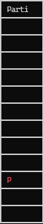
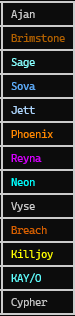
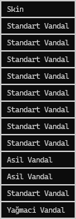
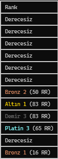
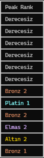
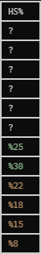
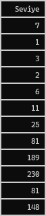

    
<h3 align="center"> X TRACKER - VALORANT</h3>
    
    
  <ol>
    <li><a href="#proje-hakkında">Proje Hakkında</a></li>
    <li><a href="#kullanım">Kullanım</a></li>
    <li><a href="#destek-ve-sorun-bildirimi">Destek ve Sorun Bildirimi</a></li>
    <li><a href="#api-kaynakları">API Kaynakları</a></li>
    <li><a href="#sorumluluk-reddi-beyanı">Sorumluluk reddi beyanı</a></li>
  </ol>

## Proje Hakkında
X Tracker Valorant, oyuncuların Valorant oyunundaki performanslarını takip edebileceği bir araçtır. Bu proje, kullanıcıların maç verilerini analiz etmelerine, istatistiklerini görselleştirmelerine ve zaman içindeki gelişimlerini izlemelerine olanak tanır.
 

|Parti|Ajan|Oyuncu|Skin|Rank|Peak Rank|HS Oranı|Seviye|
|:---:|:---:|:---:|:---:|:---:|:---:|:---:|:---:|
|||||||||

## Kullanım
**Valorant açık olmalıdır!**
  
## Destek ve Sorun Bildirimi
**Herhangi bir sorunla karşılaşırsanız, lütfen GitHub üzerinden bildirimde bulunun.**
  
## API Kaynakları
- [VALAPIDOCS - techchrism](https://valapidocs.techchrism.me/)
- [Valorant-API](https://valorant-api.com/)
  
## Sorumluluk reddi beyanı
BU PROJE, RIOT GAMES TARAFINDAN DESTEKLENMEMEKTE VEYA İLİŞKİLENDİRİLMEMEKTEDİR.   Riot Games ve tüm ilgili mülkler, Riot Games, Inc.'in ticari markaları veya tescilli ticari markalarıdır.

**Riot'un API kurallarına uyulmasına özen gösterilmiş olsa da, bu yazılımın kullanımı tamamen kendi riskinizdedir.**
